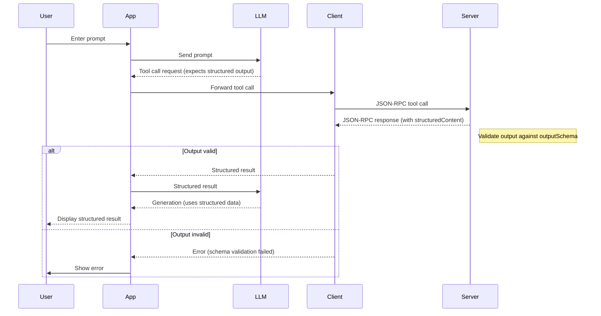

# Advanced Tools

## Tool Annotations

Tool annotations are metadata attached to each tool definition. They help clients and users understand the tool's behavior, especially regarding side effects, safety, and intended use. Annotations do **not** affect the tool's execution. They are hints for UI, approval flows, and documentation.

<callout-warning>
	Annotations are *not* security features. They are advisory only and should not
	be relied on for access control or sandboxing.
</callout-warning>

### Why Use Annotations?

- **UX clarity:** Help users understand what a tool does before approving its use.
- **Safety:** Warn about potentially destructive or open-world actions.
- **Automation:** Allow clients to group, filter, or require extra approval for certain tools.

### Example Tool Definition: Launch Real-Life Confetti

Here's a fun (and slightly dangerous) example of a tool that launches a real confetti cannon in the physical world:

```ts
{
	name: 'launch_confetti',
	description:
		'Launch a real confetti cannon in the physical world to celebrate! (Warning: may make a mess)',
	inputSchema: {
		type: 'object',
		properties: {
			color: { type: 'string', description: 'The color of the confetti' },
			intensity: {
				type: 'string',
				enum: ['low', 'medium', 'high'],
				description: 'How much confetti to launch',
			},
			location: {
				type: 'string',
				description:
					"Where to launch the confetti (e.g., 'main office', 'living room')",
			},
		},
		required: ['color', 'location'],
	},
	annotations: {
		title: 'Launch Real-Life Confetti',
		readOnlyHint: false,
		destructiveHint: true,
		idempotentHint: false,
		openWorldHint: true,
	},
}
```

- `readOnlyHint: false` - This tool physically changes the environment (and makes a mess!).
- `destructiveHint: true` - Launching confetti can be considered a destructive action (cleanup required).
- `openWorldHint: true` - This tool literally interacts with the real world, not just the local system/service provider.
- `idempotentHint: false` - This tool is not idempotent because it makes a mess (and the cannon may need a reload to work again).

<callout-warning>
	A tool like this should require explicit user approval and be used with
	caution. Imagine the consequences of launching confetti in the wrong place at
	the wrong time!
</callout-warning>

### How Annotations Affect the Client

Clients can use annotations to:

- Display warnings or require confirmation for destructive tools
- Group or filter tools (e.g., show only read-only tools)
- Provide friendlier names in the UI
- Decide when to allow automation or require human approval

<callout-success>
	Annotations make it easier to build safe, user-friendly interfaces for tool
	invocation.
</callout-success>

### Recommended Practices

1. **Be accurate about side effects:** Mark tools as `readOnlyHint: true` only if they never modify state.
2. **Use descriptive titles:** The `title` annotation should be clear and human-friendly.
3. **Indicate idempotency:** Use `idempotentHint: true` only if repeated calls with the same arguments are safe and have no extra effect.
4. **Set open/closed world hints:** Use `openWorldHint: true` for tools that interact with the internet or external systems.
5. **Remember: annotations are hints!** Never rely on them for security or correctness.

<callout-muted>
	Annotations are for humans and UIs, not for enforcing security or correctness.
</callout-muted>

### Learn More 📜

For a full list of available annotations and their meanings, see the [official MCP documentation on tool annotations](https://modelcontextprotocol.io/docs/concepts/tools#tool-annotations).

## Structured Output and Output Schemas

Structured output allows tools to return rich, machine-validated data instead of just plain text. By defining an `outputSchema` for a tool, the server ensures that all tool responses conform to a specific structure, making it easier for clients and LLMs to consume, validate, and act on the results.

### Why Use Structured Output?

- **Reliability:** Ensures tool responses are predictable and machine-parseable.
- **Validation:** Automatic schema validation prevents malformed or incomplete data from propagating.
- **Automation:** Enables downstream automation, UI rendering, and chaining of tool results.
- **Safety:** Reduces the risk of misinterpretation or injection by strictly defining expected output.

### How It Works

1. **Tool Definition:** The tool specifies an `outputSchema` (JSON Schema) describing the expected result structure.
2. **Tool Execution:** When the tool is called, the server validates the output against the schema before returning it to the client.
3. **Client Consumption:** Clients and LLMs can safely parse and use the structured result, knowing it matches the schema.
4. **Error Handling:** If the output does not match the schema, an error is returned instead of invalid data.

### Example Tool with Output Schema

Suppose we have a tool that generates a random fantasy character profile:

```ts
{
	name: 'generate_fantasy_character',
	description:
		'Creates a random fantasy character profile for games or stories.',
	inputSchema: {
		type: 'object',
		properties: {
			theme: {
				type: 'string',
				description:
					'Optional theme for the character (e.g., "forest", "fire", "ice")',
			},
		},
		required: [],
	},
	outputSchema: {
		type: 'object',
		properties: {
			name: { type: 'string', description: "The character's name" },
			species: {
				type: 'string',
				description: 'The fantasy species (e.g., elf, orc, dragon)',
			},
			characterClass: {
				type: 'string',
				description:
					"The character's class or role (e.g., wizard, rogue, paladin)",
			},
			abilities: {
				type: 'array',
				items: { type: 'string' },
				description: 'A list of special abilities or powers',
			},
		},
		required: ['name', 'species', 'characterClass', 'abilities'],
	},
}
```

### Example Request/Response with Structured Content

#### Request

```json
{
	"jsonrpc": "2.0",
	"id": 99,
	"method": "tools/call",
	"params": {
		"name": "generate_fantasy_character",
		"arguments": {
			"theme": "forest"
		}
	}
}
```

#### Response

```json
{
	"jsonrpc": "2.0",
	"id": 99,
	"result": {
		"content": [
			{
				"type": "text",
				"text": "{\"name\": \"Lirael Mosswhisper\", \"species\": \"Elf\", \"characterClass\": \"Druid\", \"abilities\": [\"Speak with Animals\", \"Vine Whip\", \"Forest Camouflage\"]}"
			}
		],
		"structuredContent": {
			"name": "Lirael Mosswhisper",
			"species": "Elf",
			"characterClass": "Druid",
			"abilities": ["Speak with Animals", "Vine Whip", "Forest Camouflage"]
		}
	}
}
```

### Validation Flow

Below is a sequence diagram showing how structured content is validated:



### Recommended Practices

1. **Define clear output schemas:** Use JSON Schema to describe all possible fields and types.
2. **Validate on the server:** Always validate tool output before returning to the client (the SDK does this for us).
3. **Handle validation errors gracefully:** Inform users or clients when output does not match the schema (the SDK does this for us).

For more details, see the 📜 [official MCP documentation on structured content and output schemas](https://modelcontextprotocol.io/specification/2025-06-18/server/tools#structured-content).
