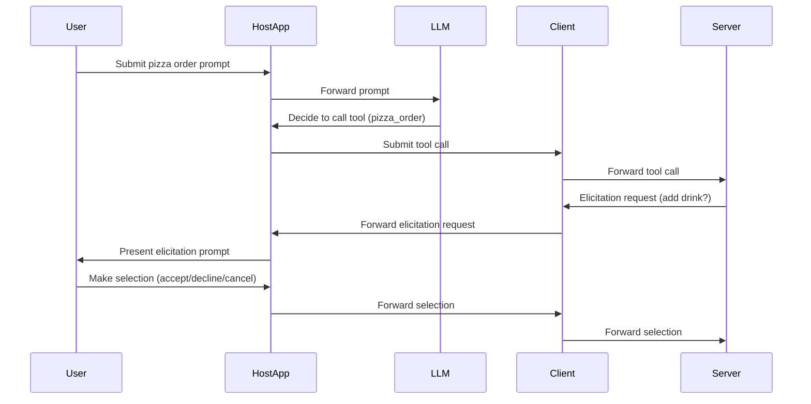

# Elicitation

Modern AI applications often need to collect structured input from users at key moments in a workflow. **Elicitation** in the Model Context Protocol (MCP) standardizes this process, allowing servers to request information from users through the client, using a well-defined schema and a secure, user-friendly interaction model.

Elicitation enables interactive workflows like confirming destructive actions, collecting additional details, or guiding users through multi-step forms by letting the server pause and ask the user for exactly what it needs, in a structured way.

<callout-info>
	Elicitation requests are always initiated by the server (so you need a
	persistent connection), but the client controls the user experience. The
	protocol does not mandate a specific UI, so clients can present prompts as
	dialogs, forms, or any interface that fits their platform.
</callout-info>

## Elicitation Human-in-the-Loop vs. Tool Call Human-in-the-Loop

When the user makes a prompt and the LLM decides to call a tool, the application should check with the user before calling the tool.

<callout-success>
	Elicitation is specifically designed for **structured, mid-process
	interactions**. Unlike general chat or form submissions, elicitation happens
	when the MCP server is actively processing a request and realizes it needs
	more information to complete the task effectively.
</callout-success>

## User Interaction Model

When an MCP server needs more information, it sends an `elicitation/create` request to the client, specifying:

- A **message** to display to the user (e.g., "What is your preferred delivery window?")
- A **requestedSchema** (using a restricted JSON Schema) describing the expected input (e.g., a string `deliveryWindow` field with enum options)

The client presents this to the user, who can:

- **Accept** (provide the requested data)
- **Decline** (explicitly refuse)
- **Cancel** (dismiss without a choice)

The server must handle all three outcomes appropriately.

<callout-success>
	Elicitation is designed for trust and safety. Servers **must not** use it to
	request sensitive information. Clients should always make it clear which
	server is requesting input, and users should be able to review, modify, or
	decline any request.
</callout-success>

## Example: Pizza Order Customization

Imagine an online pizza ordering system. After a user selects their pizza and toppings, the server wants to know if they'd like to add a drink to their order. Instead of assuming or cluttering the main UI, the server uses elicitation:

1. The user submits their pizza order.
2. The server sends an `elicitation/create` request:

```json
{
	"jsonrpc": "2.0",
	"id": 1,
	"method": "elicitation/create",
	"params": {
		"message": "Would you like to add a drink to your order?",
		"requestedSchema": {
			"type": "object",
			"properties": {
				"drink": {
					"type": "string",
					"title": "Drink Selection",
					"description": "Choose a drink to add to your order",
					"enum": ["None", "Cola", "Lemonade", "Water"],
					"enumNames": ["No drink", "Cola", "Lemonade", "Water"]
				}
			},
			"required": ["drink"]
		}
	}
}
```

The client presents this to the user, who can:

- **Accept** (provide the requested data)
- **Decline** (explicitly refuse)
- **Cancel** (dismiss without a choice)

Here's what the response from the client might look like:

```json
{
	"jsonrpc": "2.0",
	"id": 1,
	"result": {
		"action": "accept", // or "decline" or "cancel"
		"content": {
			"drink": "Cola"
		}
	}
}
```

If the user selects a drink, it's added to the order. If they choose "None" or decline, the order proceeds without a drink.

For more details, see the [MCP Elicitation Spec](https://modelcontextprotocol.io/specification/2025-06-18/client/elicitation).

## Sequence Diagram



## When to Use Elicitation

Elicitation is ideal for scenarios where:

- **Confirmation is needed** for destructive or irreversible actions
- **Additional context** would improve the quality of the response
- **User preferences** need to be clarified mid-process
- **Multi-step workflows** require intermediate user input

<callout-warning>
	Don't use elicitation for information that could have been provided in the
	initial prompt. Elicitation should only be used when the server genuinely
	needs more information to complete the current task effectively.
</callout-warning>

## Recommended Practices

- Use clear, concise messages for elicitation prompts.
- Design schemas with only the fields you truly need (avoid requesting sensitive info).
- Always handle accept, decline, and cancel actions.
- Check client capabilities before attempting elicitation.
- Use elicitation sparingly - it should enhance, not interrupt, the user experience.

## References

- 📜 [MCP Elicitation Spec](https://modelcontextprotocol.io/specification/2025-06-18/client/elicitation)
- 📜 [Elicitation Concepts](https://modelcontextprotocol.io/docs/concepts/elicitation)
- 📜 [MCP Elicitations: Standardizing Interactive AI Workflows](https://blog.fka.dev/blog/2025-01-15-mcp-elicitations-standardizing-interactive-ai-workflows/)
