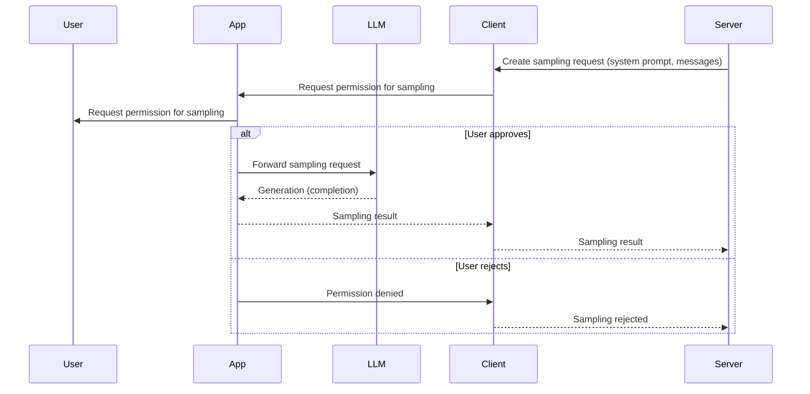

# Sampling

Modern AI applications often need to generate new content (whether that's text,
images, or more) on demand. This process is called **sampling**: asking a
language model (or other generative model) to produce a completion or response
based on a prompt and some context.

In this exercise, you'll also learn about **server-side logging** - how to send
log messages from your MCP server to the client for debugging and monitoring
purposes.

This one is a tricky one to understand. Think of it like you're "borrowing" the
user's LLM to generate content for them.
[Read about this idea here](https://www.epicai.pro/how-to-use-sampling-in-mcp-borrow-the-users-llm-o7nk3).

It may be helpful for you to watch a demo of this working:

<EpicVideo
	title="Using MCP Sampling in VSCode"
	url="https://www.epicai.pro/using-mcp-sampling-in-vs-code-insiders-dd12d"
/>

<callout-success>
	From [the MCP
	Spec](https://modelcontextprotocol.io/specification/2025-06-18/client/sampling):
	Sampling in MCP allows servers to implement agentic behaviors, by enabling LLM
	calls to occur _nested_ inside other MCP server features. Implementations are
	free to expose sampling through any interface pattern that suits their
	needs—the protocol itself does not mandate any specific user interaction
	model.
</callout-success>

Here's a sequence diagram for this:



Here's a simple example of a sampling request and response using MCP:

```json filename=server-request.json nocopy
{
	"jsonrpc": "2.0",
	"id": 1,
	"method": "sampling/createMessage",
	"params": {
		"messages": [
			{
				"role": "user",
				"content": {
					"type": "text",
					"text": "Hello, world!"
				}
			}
		],
		"systemPrompt": "You are a helpful assistant.",
		"maxTokens": 20
	}
}
```

```json filename=client-response.json nocopy
{
	"jsonrpc": "2.0",
	"id": 1,
	"result": {
		"role": "assistant",
		"content": {
			"type": "text",
			"text": "Hello! How can I help you today?"
		},
		"model": "claude-3-sonnet-20240307",
		"stopReason": "endTurn"
	}
}
```

## Your Sampling Request is a Prompt

When you make a sampling request, you're essentially crafting a prompt for the language model. The `systemPrompt` and `messages` you send become the instructions that guide the model's generation. This means that the quality and effectiveness of your sampling requests depend heavily on how well you structure your prompts.

Here are some key prompting tips for effective sampling:

- **Be specific and clear**: Instead of "generate tags," try "generate 3-5 relevant tags for a journal entry about [topic], using lowercase words separated by commas"
- **Provide examples**: Show the model what you want by including sample inputs and outputs in your prompt
- **Provide context**: Include relevant information in your messages to help the model understand what you're asking for
- **Set expectations**: Use the system prompt to establish the model's role and the format you expect
- **Test and iterate**: Start with simple prompts and refine them based on the results you get
- **Consider safety**: Structure your prompts to avoid generating harmful or inappropriate content

For more advanced prompting techniques and research-backed strategies, see [The Prompt Report](https://arxiv.org/abs/2406.06608), a comprehensive survey of 58 LLM prompting techniques and best practices for modern AI systems.

MCP standardizes how servers and clients can request these generations. Instead
of requiring every server to manage its own API keys and model integrations, MCP
lets servers request completions through a client, which handles model
selection, permissions, and user controls. This approach enables powerful
agentic behaviors—like having an LLM suggest tags for a journal entry, or
generate a summary for a document—while keeping the user in control (and it lets
you take advantage of the model for which
[your user is already paying](https://www.epicai.pro/the-cost-effective-promise-of-model-context-protocol-mcp-jnwt3)).

In this exercise, you'll extend your MCP server to leverage the sampling
capability. You'll see how to:

- Request a model completion from the client, including setting a system prompt,
  user messages, and token limits.
- Parse and validate the model's response.
- Use sampling to automate tasks in your application, such as suggesting tags
  for new journal entries.
- Send log messages from your server to the client for debugging and monitoring.

You'll also explore how to craft effective prompts for the model, and how to
structure your requests and responses for reliability and safety.

## Server-Side Logging

As part of this exercise, you'll also learn about MCP's logging capabilities. The `sendLoggingMessage` function allows your server to send log messages to the client, which can be useful for:

- **Debugging**: Send information about what your server is doing
- **Monitoring**: Track the flow of requests and responses
- **User feedback**: Provide insights into the sampling process

Log messages can have different levels (error, debug, info, notice, warning, critical, alert, emergency) and can include any JSON-serializable data.

### Log Message Examples

Here are some examples of log messages you might send during sampling:

```json filename=info-log-example.json nocopy
{
	"jsonrpc": "2.0",
	"method": "notifications/message",
	"params": {
		"level": "info",
		"logger": "sms-sender",
		"data": {
			"message": "Text message sent",
			"recipient": "1234567890",
			"content": "Hello, how are you?"
		}
	}
}
```

In the MCP inspector, this will show up in the server notifications feed. The host application may or may not show logs to the user.

- 📜 [MCP Sampling Spec](https://modelcontextprotocol.io/specification/2025-06-18/client/sampling)
- 📜 [MCP Logging Documentation](https://modelcontextprotocol.io/specification/2025-06-18/server/utilities/logging)
