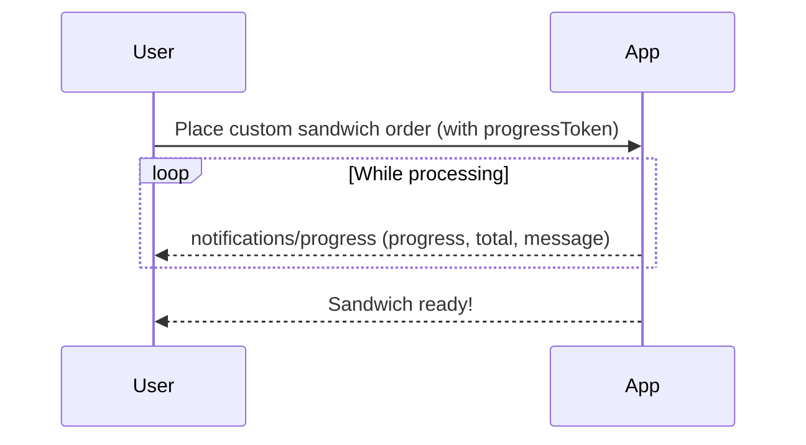

# Progress Updates

👨‍💼 When users ask our mcp server to generate their journal wrapped video, it can take some time and they want to know that things are moving along. Nobody likes staring at a blank screen, wondering if the app is frozen or if their request was even received. Progress updates are how we keep users in the loop, making the wait feel shorter and the experience more delightful.

Here's an example of how to perform progress updates in your MCP server:

```ts
agent.mcp.registerTool(
	'make_sandwich',
	{
		description: 'Make a sandwich',
		inputSchema: {
			ingredients: z.array(z.string()),
		},
	},
	async ({ ingredients }, { sendNotification, _meta }) => {
		// ...
		const orderStatus = await assembleSandwichOrder({
			ingredients,
			onProgress: (progress) => {
				const { progressToken } = _meta ?? {}
				if (!progressToken) return
				void sendNotification({
					method: 'notifications/progress',
					params: {
						progressToken,
						progress,
						total: 1,
						message: `Stacking pickles...`,
					},
				})
			},
		})
	},
	// ...
)
```

<callout-success>
	Progress updates can be as simple as a percentage, or as fun as a custom
	message. The key is to keep users informed while they wait.
</callout-success>



<callout-muted>
	📜 For more details on how to implement progress notifications, see the [MCP
	Progress
	Documentation](https://modelcontextprotocol.io/specification/2025-06-18/basic/utilities/progress).
</callout-muted>

The goal is to make waiting feel like part of the experience, not a chore. Progress updates turn a long-running task into a journey the user can follow, one delicious layer at a time.

Test this one out in the MCP inspector by using the `create_wrapped_video` tool.

<callout-info>
	**NOTE**: This particular tool requires ffmpeg to be installed globally on
	your machine. If it is not, you can still test this out using the mock time
	input (you just won't get the video actually generated).
</callout-info>
