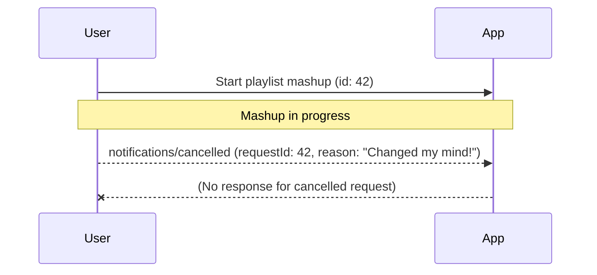

# Cancellation

👨‍💼 When users embark on creating their personalized wrapped video, the process can take a while (especially if they journal a lot). Sometimes, halfway through, they realize they picked the wrong year, or maybe their cat walks across the keyboard and they want to stop the operation immediately. It's essential that our app gives users the power to cancel these long-running tasks, so they always feel in control and never stuck waiting for something they no longer want.

Let's make sure users can hit the "Stop" button and have their request canceled right away, freeing up system resources and making the experience feel responsive and modern.

<callout-warning>
	**NOTE**: As of this writing, there is no support for a stop button in the MCP
	inspector. Follow [this
	issue](https://github.com/modelcontextprotocol/inspector/issues/591) for
	updates.
</callout-warning>

Here's an example of how cancellation can be handled in our MCP server using the `AbortController` and signals:

```ts
// the signal comes from the SDK and is passed to our tool
const controller = new AbortController()
const signal = controller.signal

async function createPlaylistMashup({
	songs,
	onProgress,
	// we pass the signal to our utility so we can add an event listener to it
	signal,
}: {
	songs: string[]
	onProgress?: (progress: number) => void
	signal?: AbortSignal
}) {
	if (signal?.aborted) throw new Error('Mashup creation was cancelled')

	// our logic...
	const promise = doTheAsyncThing()

	function onAbort() {
		// we can do something here, like send a notification to the user
		// that the mashup was cancelled. This should trigger the async thing to throw an error.
	}
	signal.addEventListener('abort', onAbort)
	await promise.finally(() => {
		// make sure to clean up regardless of whether the promise resolves or rejects
		signal.removeEventListener('abort', onAbort)
	})

	return 'Mashup complete!'
}

// Somewhere in the SDK, this gets called when the user wants to cancel:
controller.abort()
```



<callout-muted>
	📜 For more details on how to implement cancellation, see the [MCP
	Cancellation
	Documentation](https://modelcontextprotocol.io/specification/2025-06-18/basic/utilities/cancellation).
</callout-muted>

The goal is to empower users to stop long-running operations at any time, making the app feel fast, flexible, and user-friendly—even when things don't go as planned.

Now, please update our `create_wrapped_video` tool to support cancellation.

Because the MCP Inspector does not support cancellation yet, you'll need to rely on the tests to verify your cancellation is working.
