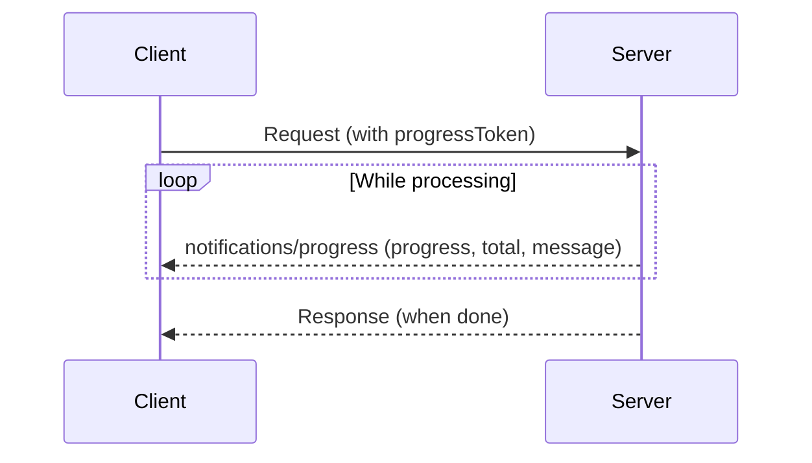
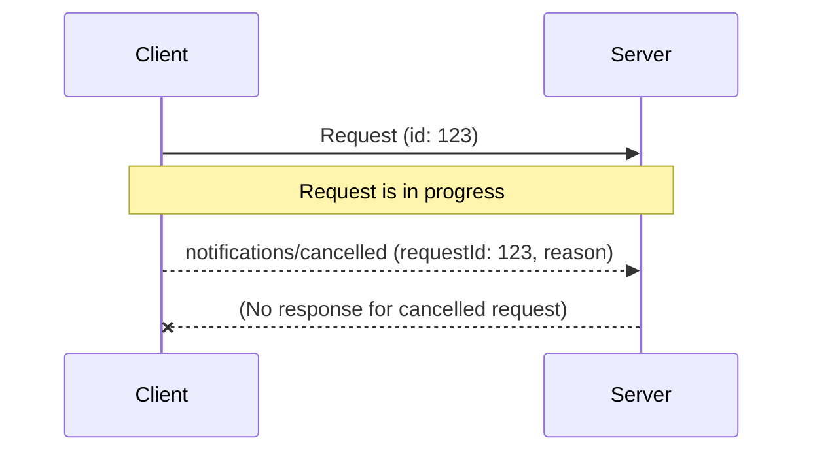

# Long Running Tasks

In this exercise, you'll learn how to handle long-running tasks in the context of the Model Context Protocol (MCP), with a focus on **progress reporting** and **cancellation**. (As a bonus, you'll also get hands-on experience with JavaScript's `AbortController` and signals, which are essential for managing asynchronous operations that can be cancelled).

## Background

Long-running operations are common in modern applications—think of file uploads, data processing, or external API calls. It's important to:

- **Report progress** to users so they know something is happening.
- **Allow cancellation** so users can stop an operation if they change their mind or if the operation is taking too long.

The Model Context Protocol (MCP) provides built-in support for both progress and cancellation via notification messages:

- [MCP Progress Documentation](https://modelcontextprotocol.io/specification/2025-06-18/basic/utilities/progress)
- [MCP Cancellation Documentation](https://modelcontextprotocol.io/specification/2025-06-18/basic/utilities/cancellation)

---

## Progress Reporting

When a client wants to receive progress updates for a long-running request, it includes a `progressToken` in the request. The server can then send progress notifications as the operation advances.

### Sequence Diagram



### Example Messages

**Client Request with Progress Token:**

```json
{
	"jsonrpc": "2.0",
	"id": 5,
	"method": "play_fetch",
	"params": {
		"_meta": {
			"progressToken": "abc123"
		}
	}
}
```

**Server Progress Notification:**

```json
{
	"jsonrpc": "2.0",
	"method": "notifications/progress",
	"params": {
		"progressToken": "abc123",
		"progress": 50,
		"total": 100,
		"message": "Stick thrown, dog is running"
	}
}
```

**Server Final Response:**

```json
{
	"jsonrpc": "2.0",
	"id": 5,
	"result": {
		"content": [
			{
				"type": "text",
				"text": "Dog successfully fetched stick"
			},
			{
				"type": "text",
				"text": "{\"status\": \"success\"}"
			}
		],
		"structuredContent": {
			"status": "success"
		}
	}
}
```

For more details, see the [MCP Progress Documentation](https://modelcontextprotocol.io/specification/2025-06-18/basic/utilities/progress).

---

## Cancellation

Either the client or server can request cancellation of an in-progress request by sending a cancellation notification. The receiver should stop processing the request and free any associated resources.

### Sequence Diagram



### Example Messages

**Client Cancellation Notification:**

```json
{
	"jsonrpc": "2.0",
	"method": "notifications/cancelled",
	"params": {
		"requestId": 5,
		"reason": "User requested cancellation, dog is too tired"
	}
}
```

- The server should stop processing the request and not send a response for the cancelled request.
- If the request is already complete or unknown, the server may ignore the cancellation notification.

For more details, see the [MCP Cancellation Documentation](https://modelcontextprotocol.io/specification/2025-06-18/basic/utilities/cancellation).

---

## Example: Using AbortController and Signals

Not everyone is familiar with signals and the `AbortController` API. Here's a simple example to illustrate how it works:

```js
const controller = new AbortController()
const signal = controller.signal

async function doLongTask(signal) {
	for (let i = 0; i < 10; i++) {
		if (signal.aborted) {
			throw new Error('Operation cancelled')
		}
		// Simulate work
		await new Promise((r) => setTimeout(r, 500))
		console.log(`Step ${i + 1} complete`)
	}
	return 'Done!'
}

doLongTask(signal)
	.then((result) => console.log(result))
	.catch((err) => console.error(err.message))

// Cancel the operation after 2 seconds
setTimeout(() => {
	controller.abort()
	console.log('Cancellation requested')
}, 2000)
```

- The `AbortController` creates a `signal` that can be passed to any async function that supports cancellation.
- The function checks `signal.aborted` to know if it should stop early.
- Calling `controller.abort()` triggers the cancellation.

For more details, see the [MDN AbortController documentation](https://developer.mozilla.org/en-US/docs/Web/API/AbortController/signal).
