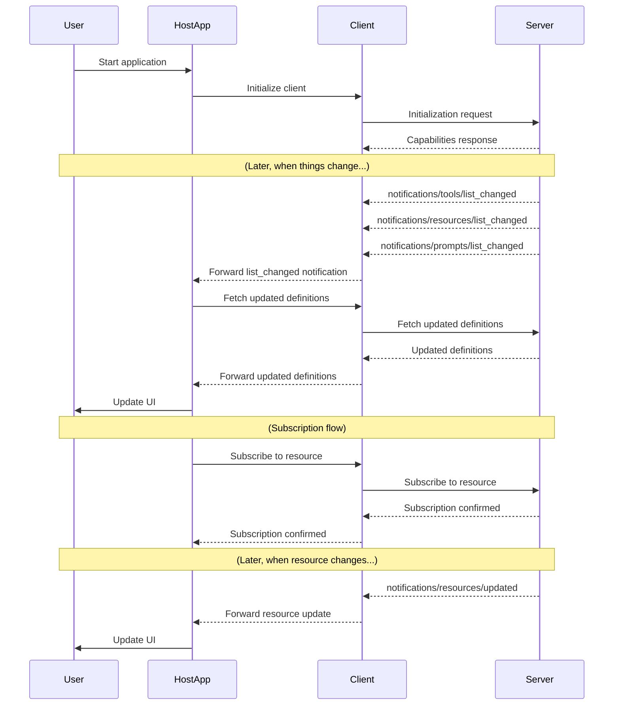

# Changes

In a web application, the buttons, links, and data that you see change based on the context. Whether the user is currently logged in, whether there is any data available, what role the user has, etc. MCP servers are no different. The information and tools they provide can change at any time.

MCP provides a robust system for **notifying clients about changes** so that UIs and agents can stay in sync with the server's current capabilities and data.

This exercise will teach you how to implement and respond to change notifications in MCP, including:

- **list_changed notifications** for tools, prompts, and resources
- Special handling for resource template list changes
- Resource update notifications and subscriptions
- Recommended practices for keeping clients and users up-to-date

<callout-info>
	Change notifications are essential for building responsive, real-time AI apps.
	They let clients update menus, toolbars, and resource lists automatically.
</callout-info>

---

## 1. List Change (Tools, Prompts, and Resources)

Whenever the set of available tools, prompts, or resources changes, the server should send a `list_changed` notification. This tells the client to refresh its list and fetch the latest definitions.

- **Tools:** If a tool is added, removed, or updated, send a `notifications/tools/list_changed` request.
- **Prompts:** If a prompt is enabled, disabled, or updated, send a `notifications/prompts/list_changed` request.
- **Resources:** If a static resource or resource template is registered, unregistered, or its metadata changes, send a `notifications/resources/list_changed` request.

<callout-success>
	Clients that support `list_changed` can provide a seamless, always-up-to-date
	experience for users, no manual refresh required!
</callout-success>

#### Example: Enabling/Disabling a Tool in Mission Control

Suppose your space station operations console has a "Dock Module" tool that should only be available when a docking port is free. When a new port becomes available, enable the tool and send a `tools/list_changed` notification. If all ports are occupied, disable the tool and notify again.

```ts
// Pseudocode
if (freeDockingPorts.length > 0 && !dockModuleTool.enabled) {
	dockModuleTool.enable()
} else if (freeDockingPorts.length === 0 && dockModuleTool.enabled) {
	dockModuleTool.disable()
}
```

The TypeScript SDK automatically sends `list_changed` notifications when tools are enabled or disabled. To avoid over-sending notifications, you should check whether the tool is already enabled or disabled before enabling or disabling it.

<callout-info>
	[In the
	future](https://github.com/modelcontextprotocol/typescript-sdk/pull/746),
	`list_changed` will be batched to avoid sending too many notifications.
</callout-info>

## 2. Resource List Change (Templates and Expansions)

Resources are special because there's a difference between what the
ResourceTemplate "expands" into and whether that resource template is available
in the first place:

```ts lines=4-6,17-18
const ingredientsResource = agent.server.registerResource(
	'ingredient',
	new ResourceTemplate('sandwich://ingredients/{id}', {
		list: async () => {
			// what this returns can change as a result of database changes etc.
		},
	}),
	{
		title: 'Ingredient',
		description: 'A single sandwich ingredient by ID',
	},
	async (uri, { id }) => {
		// ...
	},
)

// this can also change as a result of user's access
ingredientsResource.enable() // or disable()
```

Resources in MCP can be either static (a single file, a database record) or dynamic via **resource templates** (e.g., a directory of files, a database table, or even a set of modules on a space station 🚀). Resource templates allow the server to expose a pattern or collection of resources that can change over time.

A `notifications/resources/list_changed` notification is sent when:

- A new resource template is enabled/disabled
- The set of expansions for a template changes (e.g., a new module docks, a new experiment log appears, or a file is added to a directory)
- The metadata for a resource or template changes (e.g., the title of a module changes)

## 3. Resource Subscriptions (Updates to Specific URIs)

While `list_changed` tells clients about changes in what resources are available, **resource subscriptions** are about changes to the content of a specific resource URI. Clients can subscribe to updates for a particular resource (e.g., a specific module or experiment log) and receive a `notifications/resources/updated` notification when its content changes.

- Clients subscribe to resource URIs using the `subscribe` capability
- The server tracks subscriptions and notifies only interested clients

#### Example: Subscribing to Module Status Updates

A client wants to stay updated on a specific space station module:

```json
{
	"jsonrpc": "2.0",
	"id": 1,
	"method": "resources/subscribe",
	"params": { "uri": "spacestation://modules/habitat-alpha" }
}
```

When the module's status changes (e.g., a new experiment starts, or the module is undocked), the server sends:

```json
{
	"jsonrpc": "2.0",
	"method": "notifications/resources/updated",
	"params": {
		"uri": "spacestation://modules/habitat-alpha",
		"title": "Habitat Alpha Module"
	}
}
```

<callout-muted>
	Subscriptions are for updates to the content of a specific resource URI, not
	for changes in the set of available resources. Use `list_changed` for the
	latter.
</callout-muted>

---

## Sequence Diagram

This all might work a little bit like this:



## References

- 📜 [Server Spec: Resources](https://modelcontextprotocol.io/specification/2025-06-18/server/resources)
- 📜 [Server Spec: Tools](https://modelcontextprotocol.io/specification/2025-06-18/server/tools)
- 📜 [Server Spec: Prompts](https://modelcontextprotocol.io/specification/2025-06-18/server/prompts)
